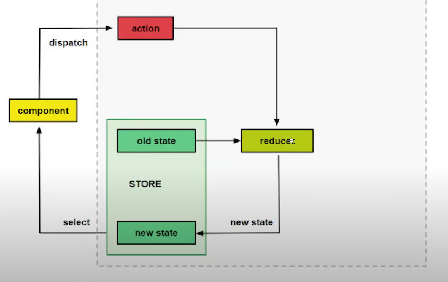

# Angular state management made simple with NgRx

### Managing state in frontend applications
Unlike backend applications, which use databases for state management, frontend applications need some sort of mechanism for handling data. This data can range from server responses gotten from HTTP request, to form input data and user routes.

It's a good practice to compose all your application state in a central store for easy management and data communication. So, basically, our state is a representation of our application that actually lives in the store.

### What is NgRx?
NgRx is a group of Angular libraries for reactive extensions and state management. It makes Angular development easier by simplifying the application's state in objects and enforcing unidirectional data flow.

A comeplete state management system should enable you to model a state — e.g., create a simple representation of what the state should look like, update its value, monitor the state when the value changes, and retrieve the values of the state.

Libraries included in the NgRx package include:
- Store
- Effects
- Entity
- ComponentStore
- Router Store

For this tutorial, we’ll mostly focus on the Store library. Specifically, we’ll demonstrate how Angular components can get values from a single store.

### What is NgRx Store?
The NgRx Store is a Redux-inspired state management system that enables you to use observables to manage state in an Angular application. The primary advantage to using the NgRx Store is the ability to store all state in a single tree that is accessible from any part of the application.

### NgRx and Redux
NgRx uses the Redux pattern, which is comprised of three main concepts:
1. Store, a central store that holds all of the application state
2. Action, which describes all the changes in the state of the application
3. Reducers, which tie the store and actions together by using the defined action to carry out a state transition, depending on the action



The diagram above clearly illustrates the concept of Redux and shows how it manages state. Note that NgRx also uses this pattern.

Let's say, for instance, we have a button in a particular component that, when clicked, changes the value of the page header. We'll use NgRx to handle that.

First, the component dispatches an action. The action then goes to the reducer. The reducer is a simple method that takes the current state and the action as a parameter and then returns a new state. When the reducer returns the new state, the component then subscribes to a selector to get the new value.

The state is never changed directly. Instead, the reducer always creates a new state. This is known as immutability.

### Using store states, actions, and reducers in NgRx
In this section, we'll demonstrate how to use store states, actions, and reducers to simplify state management in Angular.

**Store state**

A store is basically a Javascript object that holds data we'll be using in our application. 

A simple store takes the following format:
```javascript
const state = {
    persons: [
        {
            name: "Wisdom Ekpot",
            age: 10
        }, {
            name: "John Cat",
            age: 40
        },
        {
            name: "James John",
            age: 11
        }
    ],
    bookDescription: {
        name: "Name of book",
        author: "Wisdom Ekpot"
    }
}
```

**Actions**

Action are methods dispatched by the component when an event is called. 

Here you can define a type and also the payload it will be sending:
```javascript
const ChangeNameAction = {
    type: "Change Name",
    name: "Wisdom"
}
```

**Reducers**

The `createReducer` method handles state transitions.

To access the state, we have to import the initial state into the reducer file. To trigger an action, we use the `on` event, which takes the name of the action as a parameter:
```javascript
const _reducer = createReducer(
    initialState,
    on(nameOfAction, (state, action) => {
        return {
            ...state,
            someState: action.anyState
        }
    })
)
```

### Building a simple Angular app using NgRx Store
Create a `store` directory inside your src/app directory. This is where all the NgRx features will be added.

Inside the `store` directory, create a `models` directory and, inside it, a courseItem.model.ts file. We'll define our interface for our course list in this file:
```typescript
export interface CourseItem {
    id: string;
    department: string;
    name: string;
}
```

Next, create an `Actions` directory inside the `store` directory. This is where all the NgRx actions will be defined.

Create a course.action.ts file inside the `actions` directory and add the following:
```typescript
import { Action } from '@ngrx/store';
import { CourseItem } from '../models/courseItem.model';

export enum CourseActionType {
    ADD_ITEM = '[COURSE] Add Course',
}

export class AddItemAction implements Action {
    readonly type = CourseActionType.ADD_ITEM;
    // add an optional payload
    constructor(public payload: CourseItem) {}    
}

export type CourseAction = AddItemAction;
```

We start by importing the NgRx Action from the store and then also import the courseItem interface that we defined. This has a lot of use cases; here, we'll use it as a simple validation for our actions.

We'll use typescript enum to define an action that allows us to declare a set of named constants, such as a collection of related numeric or string values.

After doing this, we create an AddItemAction, which implements the NgRx Action. Every NgRx Action has two main properties: a type and an optional payload. The type is usually a read-only string that represents the type of action we'll be dispatching into the store. Since this is a class, we can accept an optional payload using the constructor.

Next, we'll export a CourseAction type, the value of which will be the AddItemAction action. With this defined, we need to create our reducer to help in transitioning from `stateX` to `stateY`.

Let's create a `reducers` directory inside the store directory. Inside the reducers directory, create a course.reducer.ts file and add the following:
```typescript
import { CourseItem } from '../models/courseItem.model';
import { CourseAction, CourseActionType } from '../actions/course.action';

// creata a dummy initial state
const initialState: Array<CourseItem> = [
    {
        id: '1',
        department: 'Computer Engineering',
        name: 'C++ Programming'
    }
]
export function courseReducer(
    state: Array<CourseItem> = initialState,
    action: CourseAction
) {
    switch (action.type) {
        case CourseActionType.ADD_ITEM:
            return [...state, action.payload]
        default: 
            return state;
    }
}
```

The first thing to do is import the `courseItem` model, `CourseAction` action, and `CourseActionType` action. For now, we'll create an initial state that will use the `CourseItem` interface for validation.

We create a reducer function that takes a `state` and an action as a parameter. The state parameter will be a type of array, the value of which will be defined initial state we just created. We use the Javascript statement to check if the action type is defined in our actions file. If it does exist, it returns the state and the action payload. If not, it just returns the state.

Recall that the objective of NgRx or any state management system is to keep all application state in a single store so that it can be assessable from any part of the application. Let's create a state.model.ts file inside the models directory.
```typescript
import { CourseItem } from './courseItem.model';

export interface State {
    readonly courses: Array<CourseItem>;
}
```

Now we have to register NgRx in our root app.modules.ts file. Import CourseReducer and then register it in the import array. We'll also import the Angular FormsModule, which we'll be using shortly:
```typescript
import { CourseReducer } from './store/reducers/course.reducer';
import { FormsModule } from '@angular/forms';
```
```typescript
imports: [
    FormsModule,
    StoreModule.forRoot({
        course: CourseReducer,
    })
]
```

We can now use NgRx in our components. Let's start by modifying our root app.component.ts file to the following:
```typescript
import { Component, OnInit } from '@angular/core';
import { Store } from '@ngrx/store';
import { Observable } from 'rxjs';
import { CourseItem } from './store/models/courseItem.model';
import { AppState } from './store/models/app-state.model';

@Component({
    selector: 'app-root',
    templateUrl: './app.component.html',
    styleUrls: ['./app.component.css'],
})
export class AppComponent implements OnInit {
    courseItem$: Observable<Array<CourseItem>>;

    constructor(private store: Store<AppState>) {}

    ngOnInit(): void {
        this.courseItem$ = this.store.select((store) => store.course);
    }
}
```

We bring in RxJs Observables, our defined `courseItem` interface, and our app state. We set `courseItem$` to a type of observable, which will be a type of array. We then set the value of `courseItem$` to the returned store.

We can now use this in our template. We'll delete all of our template HTML in app.component.html and convert it to the following:
```html
<h4>Testing NgRx</h4>
<ul>
  <li *ngFor="let course of courseItems$ | async">
    {{course.department}}
  </li>
</ul>
```

We can use async to automatically subscribe to an observable and run our application using the ng serve command. Running the application on the browser will display this:


This is returned because we haven’t called any reducer, so it just returns the state.

#### Adding a course
The next functionality we'll tackle is adding a course to our list of courses. We'll create a simple form for users to add a new course.
```html
<!-- app/index.html -->
<!doctype html>
<html lang="en">
<head>
  <meta charset="utf-8">
  <title>CourseList</title>
  <base href="/">
  <meta name="viewport" content="width=device-width, initial-scale=1">
  <link rel="icon" type="image/x-icon" href="favicon.ico">
  <link rel="stylesheet" href="https://cdn.jsdelivr.net/npm/bootstrap@4.6.0/dist/css/bootstrap.min.css"
    integrity="sha384-B0vP5xmATw1+K9KRQjQERJvTumQW0nPEzvF6L/Z6nronJ3oUOFUFpCjEUQouq2+l" crossorigin="anonymous">
</head>
<body>
  <app-root></app-root>
</body>
</html>
```

To create a simple form for adding the course name and department in our user interface, let's modify our app.component.html file as follows:
```html
<section>
  <div class="container">
    <div class="row">
      <div class="col-md-12">
        <h4>Angular State Management</h4>
      </div>
      <div class="col-md-6">
        <ul class="list-group">
          <li class="list-group-item" *ngFor="let course of courseItems$ | async">
            {{course.name}}: <b>{{course.department}}</b>
          </li>
        </ul>
      </div>
      <div class="col-md-6">
        <div class="card p-4 shadow-sm">
          <form #myform="ngForm" (ngSubmit)="addCourse(myform)">
            <div class="form-group">
                          <label for="name">Identity</label>
                          <input type="text" class="form-control" ngModel name="id" id="id" aria-describedby="identity" required>
                        </div>
            <div class="form-group">
              <label for="name">Name</label>
              <input type="text" class="form-control" ngModel name="name" id="name" aria-describedby="name">
            </div>
            <div class="form-group">
              <label for="department">Department</label>
              <input type="text" class="form-control" ngModel name="department" id="department">
            </div>
            <button type="submit" class="btn btn-primary">Submit</button>
          </form>
        </div>
      </div>
    </div>
  </div>
</section>
```
Here, we’re using the Angular form ngModel to get the values of the form.

Next, we need to import NgForm in our Typescript file and create a method to dispatch the AddItemAction:
```typescript
import { NgForm } from '@angular/forms';
import { AddItemAction } from './store/actions/course.action';

// create the method for adding a new course and then reset the form
addCourse(form: NgForm) {
    this.store.dispatch(new AddItemAction(form.value));
    form.reset();
}
```
We can now add a new course using the form we created