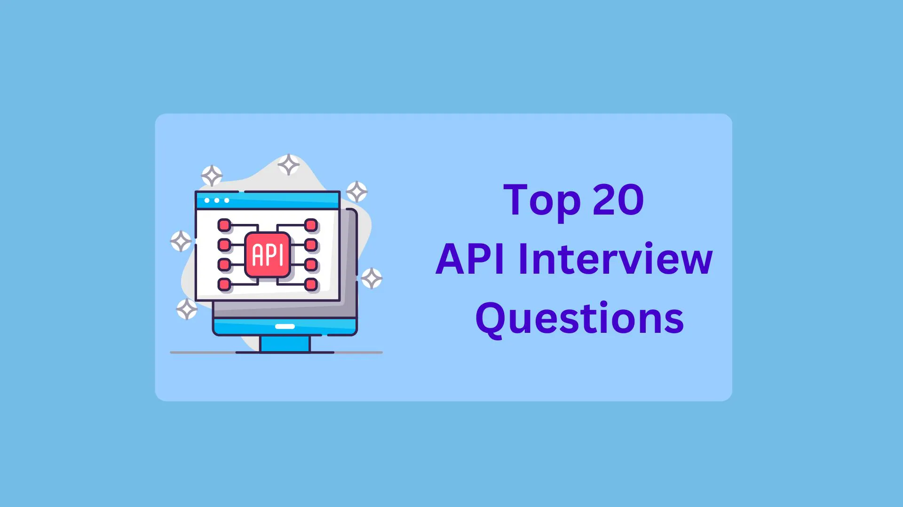

# Mastering the API Interview: Common Questions and Expert Answers



Application Programming Interface (APIs) are the backbone of modern software development, enabling different systems to communicate and share data seamlessly. For example, API can be used to share data between client and server. It can also be used to get or send data to third-party applications's databases.

## 20 Commonly Asked API Interview Questions

### 1. What is an API?

API is an acronym for Application Programming Interface. An API is a set of rules allowing different software applications to communicate and interact with each other. APIs enable the integration of different systems, making it possible for them to work together and share data seamlessly.
Furthermore, suppose the interviewer asks you to explain in more detail. In that case, you can say that API works as a bridge between different systems to talk to each other, much like how people from different cultures might communicate through a common language interpreter. This communication can involve sending and receiving data, making requests for specific actions, or retrieving information from another system.

### 2. What is a REST API?

A REST API stands for the representational State Transfer Application Programming Interface. It is an API architecture that follows the REST's principles and constraints to build scalable systems. It allows different systems to interact over HTTP via web services.

Basically, REST is an architectural style that provides simplicity in interacting with different systems.

Here are some characteristics of a REST API.

- **Statelessness**: The server doesn't store any information about the client's state when the request is made from the client. Each request from the client contains the required data to proceed with the request on the server side. So, it helps in making the system more scalable.
- **Representation**: Resources passed to the request can be represented in multiple formats such as JSON, XML, etc., which you can specify using the 'Accept' header.
- **Uniform Interface**: A consistent set of resources and endpoints simplifies the client and server interaction.

### 3. What are the most common HTTP methods used in RESTful APIs?

In RESTful APIs, there are various HTTP methods to interact with different systems and perform the CRUD(create, read, update, delete) operation.

- **GET**: The GET method is used to retrieve the data or resources from the server in different formats like JSON or XML. It returns the 200 (OK) response code when you receive the resources successfully, and in case of errors, it returns 400 or 404.
- **POST**: The POST method is used to create resources in the server. A client is required to pass the resource data as a payload of the request, and the server handles it.
- **PUT**: The PUT HTTP method is used to update the existing resources. It creates a new resources in the server if it doesn't exist. Otherwise, it replaces the old resource with the new resource.
- **PATCH**: The PATCH method also updates the data in the server, but rather than replacing the whole resource, it partially updates the existing resource.
- **DELETE**: The DELETE method is used to remove the resource from the server.


### 4. What are some real-world examples of RESTful APIs?

There are various real-time use cases of the RESTful API. Mainly, it is used in mobile development, application development, etc., for database interaction.

- **Payment Gateways**: Payment Gateways like Paypal Razorpay offer APIs so developers can integrate these payment gateways in any application and handle the transactions.
- **Weather Data**: Weather services like OpenWeatherMap provide RESTful APIs that deliver weather forecasts, current conditions, and historical weather data for specific locations.
- **Travel and Booking**: Different travel and booking companies offer RESTful API to book tickets.

### 5. What are the differences between the POST and PUT methods?

Generally, POST and PUT are both HTTP methods. The POST method is used to create new resources in the server, and PUT method is used to create new resources or update the existing resources.

|CHaracteristic |POST Method | PUT Method |
|---------------|------------|------------|
|Purpose | Creates a new resources on the server. | Updates or replaces an existing resource on the server. |
|Request Body | Includes the representation of the new resource. | Contains the representation of the updated or replaced resource.|
|Usage Scenarios | Commonly used for creating new records, submitting form data, or making non-idempotent operations. | Used for updating existing records, such as editing a user profile, modifying a document, or replacing a resource. |
| Safety | Generally considered safe, meaning it should not have side effects beyond resource creation. | Not considered safe as it can have side effects, such as updating an existing resource. |

### 6. How is data typically formatted in a RESTful API response?

In the RESTful response, data is formatted in structured text such as JSON (Javascript Object Notation) format. JSON is a lightweight and human-readable data format. However, some API also uses plain text, HTML, XML, etc. formats. Here is the sample API response in JSON format.

```json
{
    "key1": "value1",
    "key2": "value2",
    "key4": [
      "item1",
    ]
}
```

### 7. What is SOAP?
SOAP stands for the simple object access protocol. The SOAP messaging protocol uses the XML data format to exchange information between various applications over the internet. It can also be used to perform CRUD operations similar to the RESTful API.

A SOAP protocol provides support for various security features like Ws-security, allowing encryption and authentication. It is mainly used in developing enterprise-level applications in which security is essential.

### 8. What are the differences between RESTful and SOAP APIs?
The RESTful and SOAP APIs are similar, but they have some differences in messaging format, security features, etc. Also, both APIs are supported by most programming languages.

| Characteristic | RESTful APIs | SOAP APIs |
|-------|--------|--------|
| Protocol | HTTP (or other) | Usually HTTP or SMTP |
| Message Format | JSON, XML, or others | XML |
| Ease of Use | Simple, easy to learn | Complex, steep learning curve | 
| Security | No built-in security | Supports WS-Security and others |
| Flexibility | Highly flexible | Relative less flexible |
| Performance | Generally faster | Potentially slower due to XML |
| Usage | Common for public APIs | Common in enterprise settings |

### 9. How does a RESTful API differ from a GraphQL API?
GraphQL and RESTful API are powerful techniques to exchange data between systems over the internet. REST is a standard communication protocol as GraphQL is a query language that defines how client applications should request data from the server.

| Characteristic | RESTful API | GraphQL API |
| - | - | - |
| Query Flexibility | Limited, fixed endpoints | Highly flexible queries |
| Data Fetching | Multiple endpoints, varying data responses | Single endpoint, customized data responses | 
| Versioning | Often requires versioning in endpoints | No versioning required due to flexibility |
| Response Structure | Server dictates structure | Client specify structure |
| Caching | Caching can be challenging | Supports efficient caching |
| Complexity | Simplicity in design | More complex query structure |
| Tooling and Ecosystem | Well-established, mature tooling | Evolving, growing ecosystem |
| Learning Curve | Relatively straightforward | May have a steeper learning curve |

### 10. What is API testing?
API testing is a technique for software testing. API testing ensures that the system is functional, stable, reliable, consistent, etc.

In API testing, requests are sent to single or multiple endpoints, and the tester verifies whether the API gives the correct output. Also, they ensure whether the API is able to serve concurrent requests and handle the load.

### 11. What are the Types of API testing?
There are various types of testing needed to perform during the API testing. 

- **Functional testing**: To ensure whether the API is fully functional 
- **Security testing**: To ensure whether the system is secure and prevents unauthorized access or not.
- **Performance testing**: It is used to check the performance of API, including response time.
- **Load testing**: It test APIs under the various level of loads.

There are some other types of API testing given below.
- Error handling
- Regression testing
- Integration testing
- Penetration testing
- UI testing

### 12. What are the Benefits of API testing?
There are various advantages of API testing. It allows developers to develop efficient and reliable APIs.
- **Efficiency**: API tests are generally faster and more efficient than end-to-end UI tests. They provide rapid feedback to developers, helping them identify and fix issues more quickly.
- **Cost-Effective**: API testing can reduce the overall testing cost by avoiding the need for extensive UI testing and reducing the need for manual testing.
- **Universal Language Understanding**: You can use any programming language during the API testing as it exchanges the data between XML and JSON format.

### 13. Which tools are used for API testing?
There are various tools available on the internet for API testing. It can be used to automate API testing and make API requests to the system without using any programming language.
- The Katalon Platform
- Postman
- Apigee
- JMeter
- Assertible
- Soap UI
- Karate DSL
- API Fortress
- Pyresttest
- Airborne

### 14. What are the differences between API Testing and Unit Testing?
API testing and Unit testing are both essential testing strategies for software testing. However, they differ in their scope and levels at which they operate. 
Look at the different tables of API testing and Unit testing.
| Characteristic | API Testing | Unit Testing |
| - | - | - |
| Scope | Higher level, testing APIs and services | Lower level, testing individual code units |
| Purpose | Functional and integration testing | Functional and behavior testing of code units |
| Dependencies | Involves external dependencies, real-world interactions | Typically isolated frome external dependencies, dependencies are often mocked |
| Data Validation | Validates data exchange and format | Validates data and logic within the code unit |
| Testing tools | May use specialized API testing tools like Postman or REST Assured | Utilizes unit testing framworks specific to the programming language |

### 15. What is the difference between UI and API testing?
UI, or User Interface and API testing, are two different testing strategies used for software or application testing.

| Characteristic | UI Testing | API Testing |
| - | - | - |
| Scope | User interface and front-end testing | Back-end and API/service testing |
| Purpose | Evaluates user experience, front-end functionality | Test API functionality, data exchange, and integration |
| Interactions | Simulates user interactions with the UI | Programmatically interacts with APIs and services |
| Dependencies | Dependent on the availability of the user interface | Dependent on back-end components and APIs |
| Data Validation | Validates correctness of input fields and displayed output | Validates data exchange, data format, and API behavior |
| Testing tools | Uses UI automation tools like Selenium, Appium, or TestCafe | Employs specialized API testing, tools like Postman, REST Assured, or Insomnia |

### 16. What is versioning in APIs, and why is it essential?
API versioning refers to providing multiple versions of API to ensure backward compatibility and maintain the stability of the existing system, allowing the introduction of new features in API.

**Advantages of API versioning**:
- It offers backward compatibility.
- It prevents breaking changes in the system.
- It gives flexibility to clients to stick with the older version or migrate to the new version.
- By versioning, you can improve API without forcing clients to upgrade their code.

**Methods for API versioning**:
There are 3 different methods for API versioning: 
- URL Versioning: https://api.example.com/v1/resource
- Custom Header: Include a custom API-Version header in the request.
- Query Parameter: https://api.example.com/resource?version=1

### 17. What is the API documentation?
API documentation is a technical content or resource providing information about how to use API, how to interact with API, and how to integrate API into your application. It is a guide for the API developers and API users. API documentation can help new or existing API developers extend the functionality of APIs, and it can help API users integrate API into their applications.
API document explains the below components about using the particular API.
- Explains the purpose of API.
- Explains how various Authorization methods use API.
- Conveys which HTTP method should be used.
- Explains the request and response format.
- API documentation can also contain examples and code samples.
- It also contains information about different parameters.
- It also explains what query parameters you should pass to the API endpoint.

### 18. Explain the concept of API rate limiting.
Rate limiting refers to preventing API users from making more than a particular number of requests in the given timeframe. The general timeframe considered is second for API rate limiting, but some developers use millisecond, minute, or day.

For example, if the API rate limit is set to 10 requests/second, users can't make more than 10 requests per second. If they exceed 10 requests/second, API will return the error.

Real-time use cases of Api rate limiter:
- Public APIs: The Public APIs gets requests from various clients, including softwares, application, and mobile apps. Rate limiting helps to provide a consistent experience to all users.
- API subscription plans: Some organizations provide paid API, and they offer different subscription plans according to the number of requests you need to make per day or month. So, they need a rate limiter to serve you resources based on your subscription plan. 

### 19. What is the purpose of HTTP status code in API response?
HTTP status codes help API users to identify the status of the response they get from API. In some cases, a custom error or success message returned by the API might not be cleared, but you can identify the status of the response using the status codes. It also help in debugging and troubleshooting the API.
- 200 OK: Indicates a successful request.
- 201 Created: When a new resource is created successfully in the server.
- 400 Bad Request: When you pass unformatted data as a payload.
- 401 Unauthorized: When a client is not authorized by the server.
- 404 Not Found: Indicates that the requested resource does not exist on the server.
- 429 Too Many Requests: When you exceed the API rate limti.
- 500 Internal Server Error: When any server-side error occurs.

### 20. What is Cross-Origin Resource Sharing (CORS), and why is it important for web APIs?
CORS is a security feature implemented in the web browser to allow or restrict the web applications running at one origin to interact with resources hosted on another origin. Here, origin refers to the domain.

However, you can pass the authorization headers to API requests to access the resources from the server. CORS can control API accessibility.

