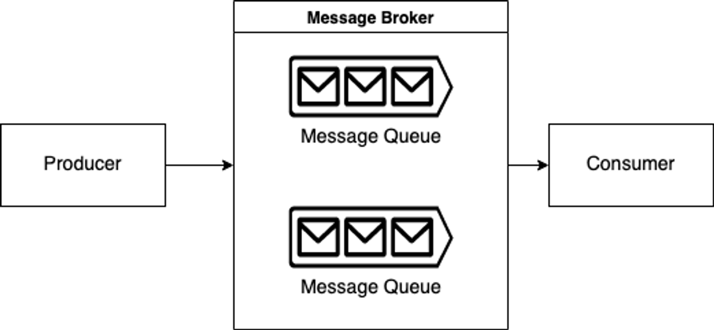
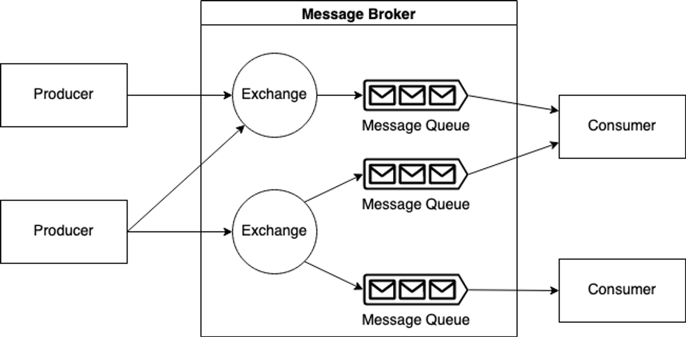

# Message Brokers

### What is a Message Broker?
- A message broker is software that enables applications, systems, and services to communicate with each other and exchange information. The message broker does this by translating messages between formal messaging protocols.
- This allows interdependent services to "talk" with one another directly, even if they were written in different languages or implemented on different platforms.
- Message brokers can validate, store, route, and deliver messages to appropriate destinations.
- They serve as intermediaries between other applications, allowing senders to issue messages without knowing where the receivers are, whether or not they are active, or how many of them there are.
- This faciliates decoupling of processes and services within systems.

In order to provide reliable message storage and guaranteed delivery, message broker often rely on a substructure or component called a **message queue** that stores and orders the message untinl the consuming applications can process them. In a message queue, messages are stored in the exact order in which they were transmitted and remain in the queue until receipt is confirmed.

Basic concepts of a message broker:
-  **Producer** - the application responsible for sending messages. It's connected with the message broker. In publish/subscribe pattern they are called `publishers`.
- **Consumer** - the endpoint that consumes messages waiting in the message broker. In publish/subscribe pattern they are called `subscribers`. 
- **Queue/topic** - a folder in a filesystem. Message broker uses them to store messages.

### Message broker models
Message broker offer 2 basic message distribution patterns or messaging styles:

- <u>Point-to-point messaging</u>:
    - This is the distribution pattern utilized in message queues with a one-to-one relationship between the message's sender and receiver.
    - Each message in the queue is sent to only one recipient and is consumed only once.
    - Point-to-point messaging is called for when a message must be acted upon only one time.

    => Example: payroll and financial transaction processing. In these systems, both senders and receivers need a guarantee that each payment wil be sent once and once only.

- <u>Publish/subscribe messaging</u>:
    - The producer of each message publishes it to a topic, and multiple message consumers subscribe to topics from which they want to receive messages.
    - All messages published to a topic are distributed to all the applications subscribed to it.
    - This is a broadcast-style distribution method, in which there is a one-to-many relationship between the message's publisher and its consumers.

    => Example: airline landing times.

### Message broker use cases
- Financial transactions and payment processing: It's critical to be certain that payment are sent once and once only. Using a message broker to handle these transactions's data offers assurance that payment information will neither be lost nor accidentally duplicated, provides proof of receipt, and allow systems to communicate reliably even when intermediary networks are down.
- E-commerce order processing and fulfillment: Message brokers' ability to enhance fault tolerance and guarantee that messages are consumed once and once only makes them a natural choice to use when processing online orders.
- Protecting highly sensitive data at rest and in transit.

### How Message Broker Works?

- The producers transmit their messages to the component called exchange in the message broker with the specified protocols. We can think of exchanges as entry points for message brokers. Exchange is responsible for forwarding messages to the required queues according to the specified rules. In the correct usage of the message broker, messages are not directly sent to the queues.
- Consumers are also in communication with the message queues. We can think of the queues as the broker's exit points.

**<u>What are Exchange Types?</u>**
Direct and fanout are the most used types. The type is decided according to the number of queues that can communicate with exchange.
- If exchange is set up to communicate with only one queue, this exchange is called direct-exchange.
- If more than one queue is connected to an exchange and copies of incoming messages are distributed to these queues, we are using the fanout-exchange type.

**<u>What are the Message Types?</u>**
=> *event* and *command*

- Event messages are messages that are sent to the messaging system to announce to all applications that an event has occurred. It is recommended that the message names end with a past tense suffix, as they are published after the event is completed. A message called PackageDelivered can be an example. Event messages are forwarded to fanout-exchange, as they will be transmitted to the entire system. Communication with the message broker is done with the *publish* method because the message spreads throughout the system.

- Command messages are messages sent to the message broker to trigger the consumer to fulfill a request. It is recommended to include the verb of the process to be executed in the name of the message. The message named *CreateAccount* can be an example of a command message. Command is processed by a single consumer. For this reason, command messages are transmitted to direct-exchanges. Communication with the broker is carried out by the `send` method. Because in this case, it is defined to whom the message will be delivered. In this type of message, message is sent to a particular receiver rather than being published to all processes.