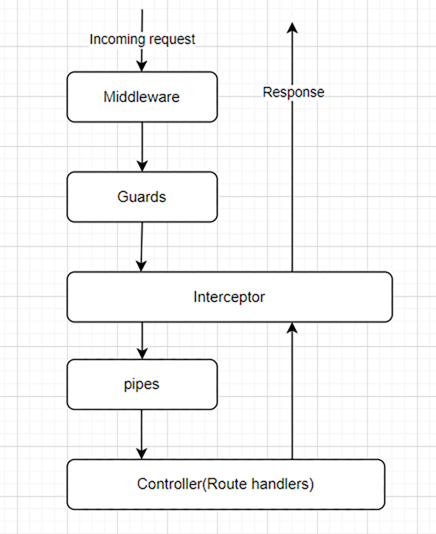
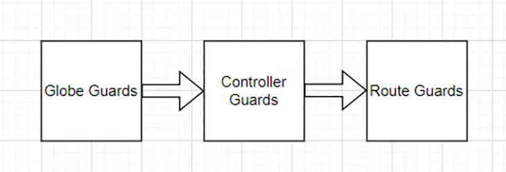

# Understanding guards in Nestjs

In programming, a guard is a common pattern of controlling program flow. It involves performing a conditional check to determine whether the code execution should continue or exit. The use of guards can improve the readability and maintainability of your code.

Guards in NestJS work in a similar way as in general programming, but its implementation is tightly integrated with the NestJS framework. The responsibility of Guards is to allow or deny access to the NestJS endpoints. For instance, we can create a guard to protect a route that updates a user's profile, to only be accessible by an administrator.

## Guards in the NestJS lifecycle

In NestJS, the request lifecycle refers to the sequence of events handling an incoming request and outgoing response.

As depicted in the below diagram, an incoming request flows through various components, such as middleware, guards, interceptors, and pipes before it reaches the endpoint and generates a response. Each of these components plays a part in handling the request and its response. Guards are executed after any defined middleware and before the interceptor is invoked.



Guards can be applied to 3 different levels:

1. Global
2. Controller
3. Route (method) scope

The sequence of guard execution follows the hierarchy as shown below, starting with global guards, followed by controller guards, and ending with route guards.



Understanding the sequence of execution allows developers to take advantage of various lifecycle events. For example, we can create a global guard to ensure only users with a valid profile can access the app. Additionally, by creating a role guard, we can configure the user controller to only allow the admin user to access it.

In other words, global guards provide general protection, while controller and route guards give us more specific access control.

## Creating an `AuthGuard`

In the official documentation, a guard is defined as:

> A class annotated with the `@Injectable()` decorator, which implements the `CanActivate` interface.

To create a guard, we must implement the `CanActivate` interface. This interface requires a `canActivate` method that is called every time a request is made to a route decorated with the guard. The `canActivate` method takes an `ExecutionContext` argument and should return a boolean value that indicates whether the route can be accessed.

`ExecutionContext` refers to the current application execution context when a request is being handled. It includes information such as:

- The current request
- Its response
- The next function handler

### Using guards to protect individual route

Below is an example of a simple guard that allows access to a route only if the request includes a valid `Authorization` header:

```typescript
// auth.guard.ts
@Injectable()
export class AuthGuard implements CanActivate {
  constructor(private reflector: Reflector) {}

  canActivate(context: ExecutionContext): boolean {
    const request = context.switchToHttp().getRequest();
    // we use a hardcoded string to validate the user for sake of simplicity
    return request.headers?.authorization === "valid_token";
  }
}
```

The above example utilizes the `switchToHttp()` method to obtain an `HttpArgumentsHost` object suitable for the HTTP application context. The request object is then extracted from the `HttpArgumentsHost` object and the request headers are examined to confirm the presence of a valid token.

Since this is a contrived example, we use a hardcoded string to validate the user for simplicity. In a real-world scenario, you should use information from a JWT token or validate it against a database.

To apply the guard, use the `@UseGuards` decorator from NestJS and pass the guard in as an argument. Below is an example of applying AuthGuard to a specific endpoint:

```typescript
import { Controller, Get, UseGuards } from "@nestjs/common";
import { AuthGuard } from "./auth.guard";

@Controller()
export class AppController {
  @Get()
  @UseGuards(AuthGuard)
  getHello(): string {
    // This route will only be accessible if the request includes a valid header
    return this.appService.getHello();
  }
}
```

### Using guards to protect controllers

We can also use guards to protect controllers, rather than just individual routes.

```typescript
import { Controller, UseGuards } from '@nestjs/common';
import { AuthGuard } from './auth.guard';

@Controller('users')
@UseGuards(AuthGuard)
export class AppController { ... }
```

To apply a guard at the application level, we can use the `useGlobalGuards` method of the NestJS application instance:

```typescript
const app = await NestFactory.create(AppModule);
app.useGlobalGuards(new RolesGuard());
```

## Creating a role guard using metadata

Role-based access control (RBAC) is a commonly used access-control mechanism defined around roles. Let's walk through how to implement basic RBAC in NestJS using guards.

Firstly, we need to define the `role` enum representing the roles

```typescript
// role.enum.ts
export enum Role {
  Admin = "Admin",
  Reader = "Reader",
  Writer = "Writer",
}
```

Next, create a `Roles` decorator to set the roles allowed for a controller or a method:

```typescript
// role.ts
import { SetMetadata } from "@nestjs/common";
import { Role } from "./clients/entities/role.enum";

export const Roles = (...roles: Role[]) => SetMetadata("roles", roles);
```

In NestJS, the `@SetMetadata` decorator is provided to attack metadata to a class or method. It stores the metadata as a key-value pair. In the above code, the key is `roles`, and the value is passed from the `roles` argument. The saved metadata can be used by the role guard later.

Now, we can create the RoleGuard:

```typescript
// role.guard.td
@Injectable()
export class RolesGuard implements CanActivate {
  constructor(private reflector: Reflector) {}

  canActivate(context: ExecutionContext): boolean {
    // get the roles required
    const roles = this.reflector.getAllAndOverride<string[]>("roles", [
      context.getHandler(),
      context.getClass(),
    ]);
    if (!roles) {
      return false;
    }
    const request = context.switchToHttp().getRequest();
    const userRoles = request.headers?.role?.split(",");
    return this.validateRoles(roles, userRoles);
  }

  validateRoles(roles: string[], userRoles: string[]) {
    return roles.some((role) => userRoles.includes(role));
  }
}
```

In the role guard, the getAllAndOverride method is used to retrieve the roles. The method takes two arguments:
1. `Key`: The metadata key
2. `Targets`: the set of decorated objects from which the metadata is retrieved

The above code gets the metadata for the `roles` key from the context of the decorated class and the decorated route handler. If different roles are associated with the class and handler, the handler metadata overrides the class metadata in the returned result.

In a nutshell, the method retrieves the `userRoles` from the request headers and calls `validateRoles` to compare the user's role with the required roles. If the user's role is present, the method returns `true` to grant the user access to the resource.

### Using the role guards with the Roles decorator
The role guard should be used in conjunction with the `Roles` decorator. In this example, we assign the `Writter` role to the `createClient` endpoint, and the `Reader` role to the getClients endpoint.
```typescript
// client.controller.ts
@Post()
@Roles(Role.Writter)
@UseGuards(RolesGuard)
create(@Body() createClientDto: CreateClientDto) {
    return this.clientsService.create(createClientDto);
}

@Get()
@Roles(Role.Reader)
@UseGuards(AuthGuard, RolesGuard)
getClients() {
    return this.clientsService.findAll();
}
```

## Skipping the authoization guard with `SkipAuthCheck`
Sometimes, we may want to skip the authorization guard. For example, we may apply an AuthGuard to a controller, but one of the endpoints within the controller is intended to be public. This can be achieved by adding specific metadata to the endpoint.

To begin, let's create an `AuthMetaData` decorator, which can be used to set the metadata with the key `'auth'` for a specific endpoint.
```typescript
import { SetMetadata } from '@nestjs/common';

export const AuthMetadata = (...metadata: string[]) => SetMetadata('auth', metadata);
```

Later, this metadata can be read by a guard. Then, we can use it to add 'skipAuthCheck' metadata to an endpoint:
```typescript
@Get('hello')
@AuthMetaData('skipAuthCheck')
getPublicHello(): string { …}
```

In the AuthGuard, we add this code block to check for the `skipAuthCheck` metadata:
```typescript
const authMetadata = this.reflector.getAllAndOverride<string[]>('auth', [
    context.getHandler(),
    context.getClass(),
]);
if(authMetaData?.includes('skipAuthCheck')) {
    return true;
}
```

This addition of the above code block will allow the auth guard to skip the check if the 'skipAuthCheck' is contained in the metadata with the key of 'auth'.

The `SkipAuthCheck` guard adds flexibility when managing access to specific endpoints.

## Using multiple guards
NestJS allows for multiple guards to be applied to a single target at either the controller or route level.
 
We can use the @UseGuards decorator to apply multiple guards, and the guards will be executed in the order in which they are bound. If any of the guards returns false, the request will be denied.

In the example below, we use the @UseGuards decorator to combine both AuthGuards and RoleGuard to the ClientsController:
```typescript
@Controller('clients')
@UseGuards(AuthGuard, RolesGuard)
export class ClientsController {
    // This controller will be protected by both the AuthGuard and the RoleGuard
}
```
In this scenario, access to the controller is granted only if both AuthGuard and RolesGuard return true.
