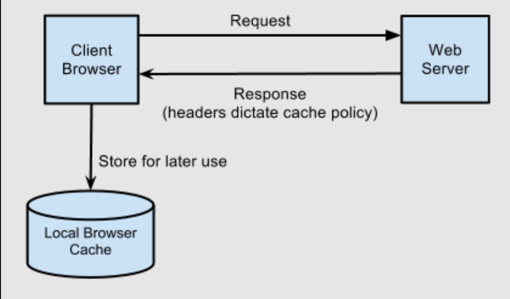

# Cookie, Cache
The difference between cache and cookies:

| S.NO | Cache | Cookies |
| - | - | - |
| 1 | Cache is employed to store the web site content for the long run purpose | While cookie is employed to store user choices |
| 2 | Cache's website contents are stored in browser only | While cookie's contents are stored in both server and browser |
| 3 | It expires manually | While it expires automatically | 
| 4 | It consumes large space in terms of capacity | While it consumes less space in terms of capacity |
| 5 | the types of cache are: Browser cache and proxy cache | the types of cookies are: Transient and persistent cookies |
| 6 | Cache stores the contents like html pages, images, Javascript, CSS, etc. | cookie store the contents like browsing session and temporary tracking data |
| 7 | Cache does not send the response with requests | cookie sends the response with requests |

## Cookie
A cookie is a small piece of information left on a visitor's computer by a website, via a web browser. 

Cookies are used to personalize a user's web experience with a website. It may contain the user's preferences or inputs when accessing that website. A user can customize their web browser to accept, reject, or delete cookies.

Cookies can be set and modified at the server level using the Set-Cookie HTTP header, or with javascript using **document.cookie**.

<u>Creating cookies:</u>

After receiving an HTTP request, a server can send one or more Set-Cookie headers with the response. The browser usually stores the cookie and sends it with requests made to the same server inside a Cookie HTTP header.

```
Set-Cookie: <cookie-name>=<cookie-value>
```

<u>Define the lifetime of a cookie:</u>

The lifetime of a cookie can be defined in two ways:
- Session cookies are deleted when the current session ends. The browser defines when the "current session" ends, and some browsers use *session restoring* when restarting. This can cause session cookies to last indefinitely.
- Permanent cookies are deleted at a date specified by the Expires attribute, or after a period of time specified by the Max-Age attribute.

```
Set-Cookie: id=a3fWa; Expires=Thu, 31 Oct 2021 07:28:00 GMT;
```
> Note: When you set an Expires date and time, they're relative to the client the cookie is being set on, not the server.

<u>Restrict access to cookies:</u>
```
Set-Cookie: id=a3fWa; Expires=Thu, 21 Oct 2021 07:28:00 GMT; Secure; HttpOnly
```

## Cache 
A **cache** (web cache or HTTP cache) is a component that stores HTTP responses temporarily so that it can be used for subsequent HTTP requests as long as it meets certain conditions.

HTTP caching occurs when the browser stores local copies of web resources for faster retrieval the next time the resource is required. As your application serves resources it can attach cache headers to the response specifying the desired cache behavior.



When an item is fully cached, the browser may choose to not contact the server at all and simply use its own cached copy.

For instance, once CSS from your application are downloaded by the browser there's no need to download them again during the user's session.

#### HTTP cache headers:
There are 2 primary cache headers, ``Cache-Control`` and ``Expires``.

##### Cache-Control:
The ``Cache-Control`` header is the most important header to set as it effectively 'switches on' caching in the browser. With this header in place, and set with a value that enables caching, the browser will cache the file for as long as specified. Without this header the browser will re-request the file on each subsequent request.

`public` resources can be cached not only by the end-user's browser but also by any intermediate proxies that may be serving many other users as well.

```
Cache-Control:public
```

`private` resources are bypassed by intermediate proxies and can only be cached by the end-client.

```
Cache-Control:private
```

The value of the `Cache-Control` header is a composite one, indicating whether the resource is public or private while also indicating the maximum amount of time it can be cached before considered stale. The `max-age` value sets a timespan for how long to cache the resource (in seconds).

```
Cache-Control:public, max-age=31536000
```


While the `Cache-Control` header turns on client-side caching and sets the `max-age` of a resource, the `Expires` header is used to specify a point in time the resource is no longer valid.

##### Expires:
When accompanying the `Cache-Control` header, `Expires` simply sets a date from which the cached resource should no longer be considered valid. From this date forward the browser will request a fresh copy of the resource. Until then, the browsers local cached copy will be used:
> If both `Exprires` and `max-age` are set, `max-age` will take precedence.
```
Cache-Control:public
Expires: Mon, 25 Jun 2012 21:31:12 GMT
```

