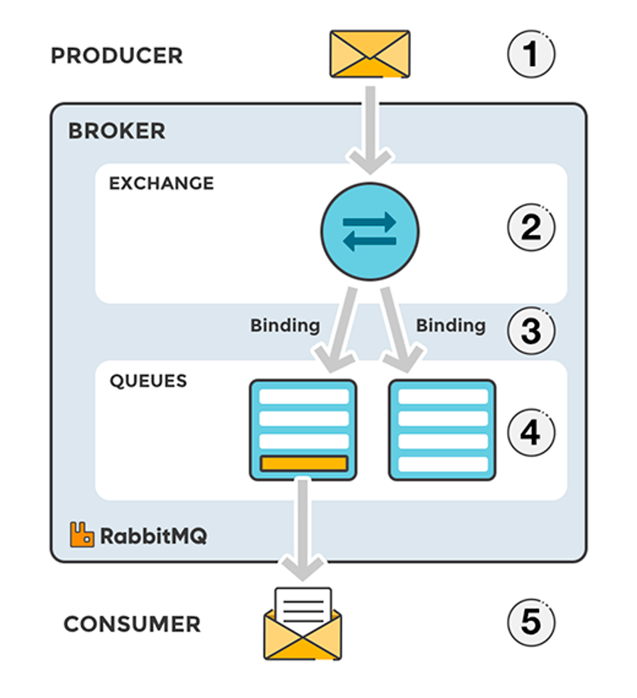
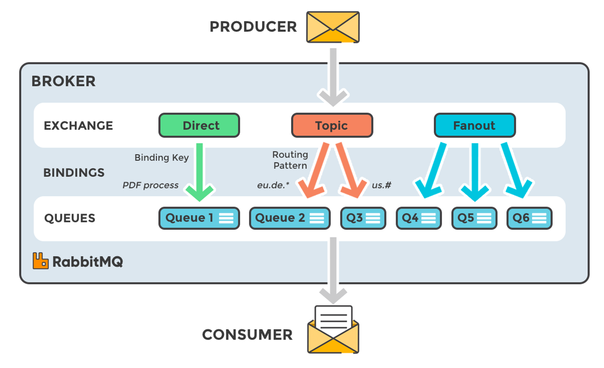

# RabbitMQ
RabbitMQ is a message-queueing software also known as a message broker or queue manager. Simply said: it is software where queues are defined, to which applications connect in order to transfer a message or messages.



1. The producer publishes a message to an exchange. When creating an exchange, the type must be specified.
2. The exchange receives the message and is not responsible for routign the message. The exchange takes different message attributes into account, such as the routing key, depending on the exchange type.
3. Bindings must be created from the exchange to queues. In this case, there are two bindings to two different queues from the exchange. The exchange routes the message into the queues depending on message attributes.
4. The messages stay in the queue until they are handled by a consumer.
5. The consumer handles the message.

### Queues
The queue is the place where messages are stored until they are consumed by the consumer, or in other ways removed from the queue. Queues have properties that define how they behave, and these properties are passed to the broker when the queue is declared.

- A queue has some required properties and some optional. A queue always has a name, so that services can reference them. A queue declared with no name, is given a random name by most client libraries.
- A queue can be marked as durable, which specifies if the queue should survive a broker restart.
- A queue can be exclusive, which specifies if the queue can be used by only one connection. An exclusive queue is deleted when that connection closes.
- A queue can also be declared with the auto-delete property, meaning that a queue that has had at least one consumer is deleted when the last consumer unsubscribes.
- There are also some optional properties used by plugins and broker-specific features, like TTL, which is telling an unused queue when to expire after a period of time.

### Exchanges
Theoretically, the exchange is the first entry point for a message entering the message broker. Messages are not published directly to a queue. Instead, the producer sends messages to an exchange, which you can think of as a message routing agent. An exchange is responsible for routing messages to different queues with the help of header attributes, bindings, and routing keys.

Exchanges can, as with queues, be configured with parameters such as durable, temporary, and auto-delete upon creation. Durable exchanges survive server restarts and exist until they are explicitly deleted. Temporary exchanges exist until RabbitMQ is shut down. Auto-deleted exchanges are removed once the last bound object js unbound from the exchange.

```typescript
channel.exchange_declare(exchange='direct_exchange', exchange_type='direct')
```

<u>Types of exchanges</u>



- **Direct**: The message is routed to the queues whose binding key exactly matches the routing key of the message. For example, if the queue is bound to the exchange with the binding key `pdfprocess`, a message published to the exchange with a routing key `pdfprocess` is routed to that queue.
- **Fanout**: A fanout exchange routes messages to all of the queues bound to it.
- **Topic**: The topic exchange does a wildcard match between the routing key and the routing pattern specified in the binding.
- **Headers**: Headers exchanges use the message header attributes for routing.

<u>Bindings</u>

- A bindingn is an association, or relation between a queue and an exchange.
- It describes which queue is interested in messages from a given exchange.
- Bindings can take an extra parameter called routing_key.
- a routing key can also be sen with a message.
- The routing key on the binding sometimes called a binding key, and the routing key in the message are the things the exchange is looking at while delivering messages.

```typescript
channel.queue_bind(exchange=exchange_name, queue=queue_name, routing_key='black')
```

### RabbitMQ and server concepts
- **Producer**: Application that sends the messages.
- **Consumer**: Application that receives the messages.
- **Queue**: Buffer that stores message.
- **Message**: Information that is sent from the producer to a consumer through RabbitMQ.
- **Connection**: A TCP connection between your application and the RabbitMQ broker.
- **Channel**: A virtual connection inside a connection. When publishing or consuming messages from a queue - it's all done over a channel.
- **Exchange**: Receives messages from producers and pushes them to queues depending on rules defined by the exchange type. To receive messages, a queue needs to be bound to at least one exchange.
- **Routing key**: A key that the exchange looks at to decide how to route the message to queues. Think of the routing key like an *address for the message*.
- **AMQP**: Advanced Message Queuing Protocol is the protocol used by RabbitMQ for messaging.
- **Users**: It is possible to connect to RabbitMQ with a given username and password. Every user can be assigned permissions such as rights to read, write and configure privileges within the instance. Users can also be assigned permissions for specific virtual hosts.
- **Vhost, virtual host**: Provides a way to segregate applications using the same RabbitMQ instance. Different users can have different permissions to different vhost and queues and exchanges can be created, so they only exist in one vhost.

### Work Queues
- The main idea behine Work Queues (aka: Task Queues) is to avoid doing a resource-intensive task immediately and having to wait for it to complete.
- Instead we schedule the task to be done later. We encapsulate a task as a message and send it to a queue.
- A worker process running in the background will pop the tasks and eventually execute the job. When you run many workers the tasks will be shared between them.

>> This concept is especially useful in web applications where it's impossible to handle a complex task during a short HTTP request window.

