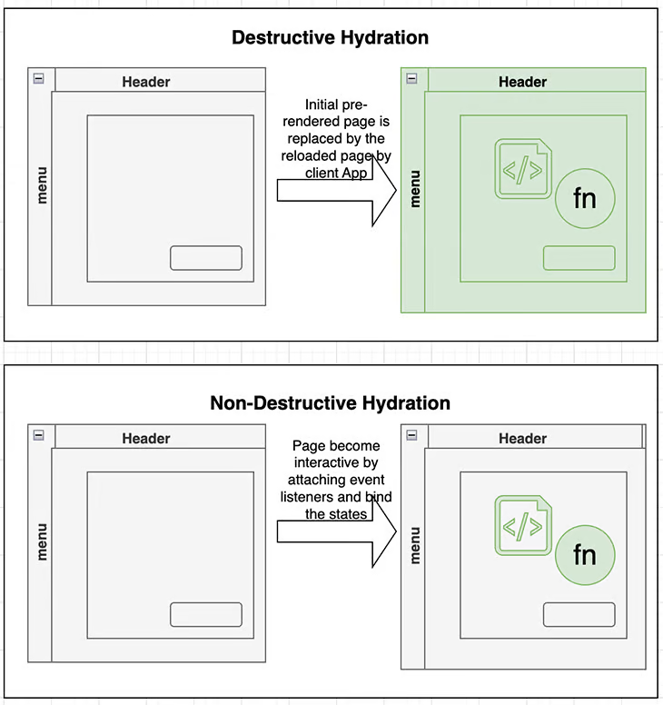

# Server-side rendering in Angular 16

## CSR vs. SSR
In a single-page app (SPA) using client-side rendering, the client application generates HTML within the browser using Javascript. When the client app sends an initial request, the web server responds with a minimal HTML file to serve as the app container. The browser then proceeds to download and execute the Javascript bundlers referenced in the HTML file to bootstrap the app.

CRS has a few disadvantages, including:
- **Blank page in initial load time**: There is a delay before the Javascript bundle is downloaded and the app is fully bootstrapped. During this time, users may see a blank page, which impact the user experience
- **Non-SEO friendly**: Webpages relying on CSR mostly contain minimal HTML with links to the Javascript bundle, so web crawlers may have difficulty in indexing the page content, which may result in reduced visibility in search engine results.

SSR, however, addresses both the blank page issue and SEO concerns.

Using SSR, the HTML is generated on the server side, so the generated pages are fully formed and SEO-friendly. It also has a faster load time for the initial request, as the HTML is returned to the browser and displayed before Javascript are downloaded. Thus, when SEO and initial load time are priorities, SSR is the recommended option.

## SSR with Angular 4 and Universal
Angular supports SSR through its Angular Universal package, a nickname for server-side rendering in Angular that refers to its ability to render at both the client and server sides.

First introduced in Angular 4, Angular Universal provides server-side rendering, including dynamic server rendering as well as static pre-rendering. However, this form of SSR had a few limitations due to its "destructive" nature.

### Angular's destructive hydration
Angular hydration is the process of adding interactivity to a server-side rendered HTML page by adding event listeners and states. Efficient hydration is critical to user experience, but it is also challenging to implement as there are many moving parts to manage.

Before Angular 16, the hydration process in Angular Universal is destructive hydration. When a pre-Angular 16 app starts, the following events take place:

1. The browser sends a request to a web server
2. The web server immediately returns the DOM structure markup of the webpage
3. The browser renders the initial version of the page markup, but it isn't interactive yet, as the Javascript hasn't loaded
4. The Javascript bundles are downloaded in the browser
5. The Angular client app takes over, loads the bundle, and is bootstraped
6. The whole page is reloaded

The above process is called destructive hydration because the client app discards the pre-rendered HTML and reloads the entire page.

It is worth noting that in step 3, the page displays some content known as the First Meaningful Paint (FMP). A quicker FMP is one the primary benefits of SSR, particularly for performance-critical apps.

The problem of destructive hydration is page flickering, which happens when the server-side-rendered markup is replaced by the client-side rendered content. Multiple issues (i.e, 13446) have been opened in the Angular GitHub repo to resolve this, and it is considered to be a main limitation of the Angular Universal.

### Angular 16: Non-destructive hydration
Angular 16 solves this problem by the introduction of non-destructive hydration. In non-destructive hydration, existing server-side-rendered DOM markup is reused. That means the server-side-rendered DOM markup isn't destroyed; instead, Angular will traverse through the DOM structure, attach the event listeners, and bind the data to complete rendering.

Below is a comparison diagram to illustrate the difference between destructive and non-destructive hydration:



Another related improvement is that `HttpClient` has been updated to enable server-side request caching. This enhancement prevents redundant data retrieval on the client side by caching previously fetched data, resulting in better performance.

### Applying SSR to an existing Angular app
In this release, Angular Universal provides more streamlined tooling support.

Assuming you have an existing Angular 16 app, we just need to run the following command to enable server-side rendering:

```bash
ng add @nguniversal/express-engine
```

This command will update your app to add a server-side application for SSR support.

To enable non-destructive hydration, we need to import the `provideClientHydration` function as the provider of `AppModule`:

```typescript
import {provideClientHydration} from '@angular/platform-browser';
// ...

@NgModule({
 // ...
 providers: [ provideClientHydration() ],  // add this line
 bootstrap: [ AppComponent ]
})
export class AppModule {
 // ...
}
```

If you open `package.json`, you will find a few new commands were added:

```json
"dev:ssr": "ng run angularSSR:serve-ssr",
"serve:ssr": "node dist/angularSSR/server/main.js",
"build:ssr": "ng build && ng run angularSSR:server",
"prerender": "ng run angularSSR:prerender"
```

To test server-side rendering in your local, run this command:
```
npm run dev:ssr
```

The app is running in SSR mode now!

It is worth noting that the new SSR feature is available in developer preview, which means that although the feature is fully functional and polished, the APIs may change at any time, including possible breaking changes.

## Angular roadmap for SSR
The Angular team has announced their plan for next steps. Angular Universal’s packages are going to be moved into the Angular framework for better developer experiences.

The Angular team is also exploring partial hydration and resumablity to enhance SSR, which we’ll explore in a bit more detail below.

### Partial hydration
Partial hydration is when parts of the component tree are skipped during initial rendering, and hydrated later by user demand. This is in contrast to full hydration, where all the components in the page are rendered at once.

Partial hydration in Angular will be an exciting enhancement to the existing SSR approach, as it enhances performance and responsiveness to a greater extent.

### Resumability
To understand resumability, let's look at the problem it tries to solve. In the hydration process, there is a period called the "Uncanny Valley". As shown in the diagram below, the uncanny valley occurs when the page is rendered but is not interactive:


The page will become interactive after all of the event handlers and application states are restored for the whole component tree. In the uncanny valley period, if the user tries to click a button or scroll the page, nothing will happen.

Resumability resolves this issue by serializing event handlers and state on the server and resuming it on the client on demand. For a resumable Angular app, if a user clicks on a button in the uncanny valley period, the button event handler will be downloaded directly and executed in the browser, without needing to download all the Javascript bundles and walk through the whole component tree.

Although resumability is a great improvement, it is a complex feature to implement and may introduce additional constraints for developer experience. The Angular team indicates that they are exploring the direction of leveraging Angular's new Signals feature to provide a solution.

