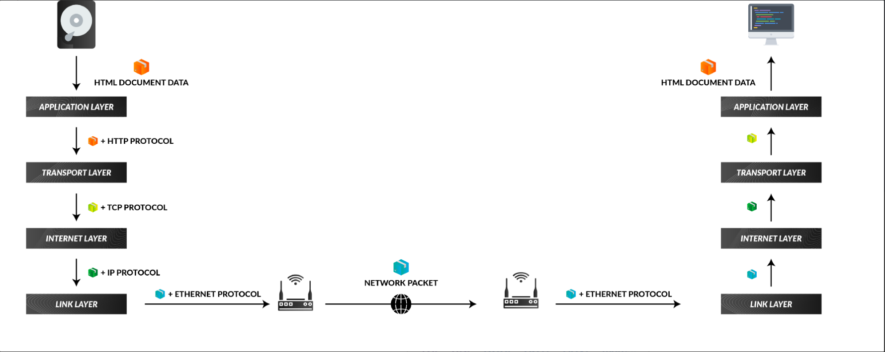
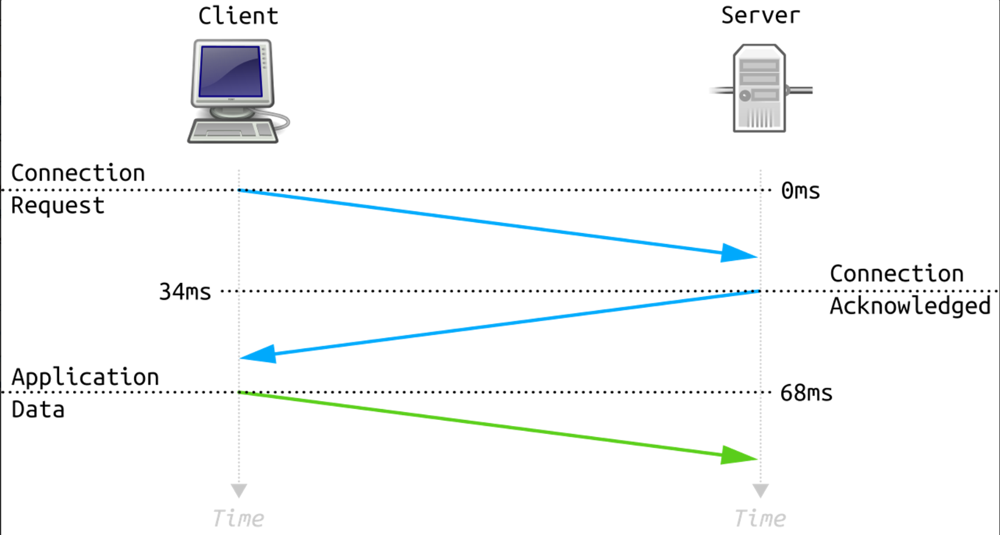
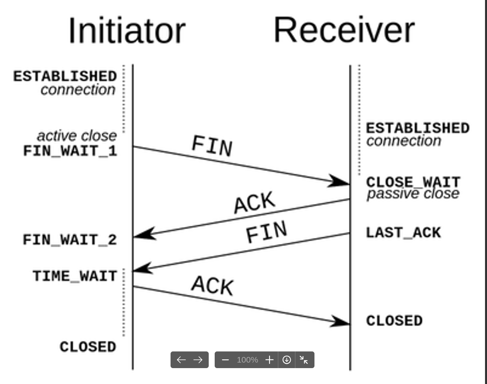
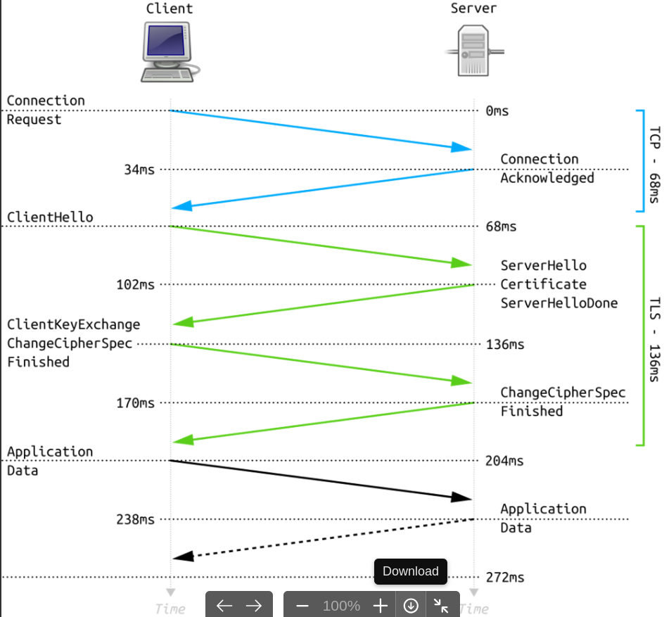

# Web protocols: TCP, HTTP, TLS/SSH, Websocket

## TCP (Transmission Control Protocol)
In the above communication model (left side), the **application layer** gets the data from a source (like internal storage or RAM) and wraps some headers of a particular protocol like **HTTP**. This creates a data package of the HTTP protocol and can be read by an application that can understand it like a web browser.

This HTTP package is sent to the **transport layer**. The transport layer wraps the package with **TCP protocol headers** along with the **source** and **destination ports**. The source port is the port of the application **transmitted** the data (like a web browser) and destination port is where the application running on the receiving side will **receive** it.

This TCP package is received by the **internet layer** which wraps some **IP protocol headers** with source and **destination IP addresses**.  The source IP address is the IP address of the sender device while the destination address is the IP address of the receiver device. [readmore: https://medium.com/jspoint/a-brief-overview-of-the-tcp-ip-model-ssl-tls-https-protocols-and-ssl-certificates-d5a6269fe29e]

Advantages:
- TCP ensures 3 things: data reaches the destination, reaches it on time, and reaches it without duplication.
- TCP automatically breaks data into packets before transmission.

Disadvantages:
- TCP cannot be used for broadcast and multicast connections.

## HTTP (Hyper Text Transfer Protocol)
The HTTP protocol is based on TCP/IP or UDP/IP protocol. Before any data is sent to the receiver, a **communication channel** should be opened between the sender and the receiver. This is done using TCP/IP alone without any **application layer**, as shown in the diagram below.

First, the client sends an empty packet (without any application data) to the sender with the TCP protocol SYN (synchronize) flag set to 1. When this packet is received by the server, it knows that a client is trying to establish a connection (session).

The server sends back an empty packet with SYN and ACK (acknowledge) flags set to 1. When the client receives this packet, it knows that the server has responded and willing to accept the request.

Then the client sends an empty packet with ACK flag set to 1. Once the server receives this packet, a TCP communication channels is opened. (called the **TCP three-way handshake**)

Once the handshake is completed and a TCP communication channel is opened, the client or server can send and receive the application data over the same connection unless the client or server closes the connection.

Once the connection is established, the HTTP protocol data was sent as the **application data** to the server in the network packet. This data contains the HTTP headers in plain text formats. **the data obviously will be encoded in binary.

Once this data is received by the server, the server can acknowledge the request by sending the data back to the client.

Once the server has sent all the data back, could be in one packet or multiple packets, the client has to acknowledge the receipts by sending empty packets that have ACK flags set to 1 and the **sequence numbers** of the packets it is sending acknowledge for.

Once the server has no more data to send, it will send an empty packet with FIN (finished) flag set to 1 to indicate the finished message. The client can acknowledge this packet to close the connection as described below.

## TLS/SSH
What is TLS?

Both the HTTP protocol layer and the TLS protocol layer are part of the **application layer**. The role of the TLS layer is to establish a secure connection with the server using a TLS handshake (after the TCP handshake) and encrypt the HTTP data using some encryption algorithms negotiated with the server.

The final encryption data becomes the **application data** of the network packet the server is going to receive. Since the application data is encrypted, any man-in-the-middle might obtain the data but won't be able to make sense of it. This prevents a man-in-the-middle attack. 

When HTTP protocol is used in conjugation with TLS protocol, it is called HTTPS protocol. To invoke a browser or a program to use TLS for the communication, we usually use https:// protocol prefix in the URL.
- Asymmetric Key Algorithm [https://medium.com/jspoint/a-brief-overview-of-the-tcp-ip-model-ssl-tls-https-protocols-and-ssl-certificates-d5a6269fe29e#:~:text=In%20Asymmetric%20key,shared%20symmetric%20key.]
- Symmetric Key Algorithm [https://medium.com/jspoint/a-brief-overview-of-the-tcp-ip-model-ssl-tls-https-protocols-and-ssl-certificates-d5a6269fe29e#:~:text=In%20the%20symmetric,Advanced%20Encryption%20Standard).]

<u>HTTPS Handshake with TLS 1.2</u>

What is SSH?
SSH, also known as **Secure Shell** or **Secure Socket Shell**, is a network protocol that provides administrators with a secure way to access a remote computer. SSH establishes a cryptographically secured connection between two parties (client and server), authenticating each side to the other, and passing commands and output back and forth.

SSH vs SSH/TLS - Differences Between both Security Protocols

SSH and SSL/TLS generally have different purposes. SSH is often used by network administrators for tasks that a normal internet user would never have to deal with. SSL/TLS, on the other hand, is used by the average internet user all the time. Anytime someone uses a website with a URL that starts with HTTPS, he is on a site with SSL/TLS.

| SSH (Secure Shell) | SSL/TLS (Secure Socket Layer/ Transport Socket Layer) |
| - | - |
| SSH runs on port 22 | SSL runs on port 443 |
| SSH is for securely executing commands on a server | SSL is used for securely communicating personal information |
| SSH uses a username/password authentication system to establish a secure connection | SSL normally uses X.509 digital certificates for server and client authentication |
| SSH is working based on network tunnels | SSL is working based on digital certificates | 
| SSH is a remote protocol | SSL is security protocol |
| It is used to reduce security threats for remote server login | It allows secure transition of data between a server and the browser thus, keeps information intact |
| SSH follows authentication process by server's verification done by client, session key generation, and client's authentication | SSL follows authentication process by exchange of digital certificate | 
| Data integrity is measured with algorithms like SHA, SHA-2, SHA-256 | Data integrity is measured with the message digest and added to encrypted data before the data is sent |

## Websocket
"**WebSockets**" is an advanced technology that allows real-time interactive communication between the client browser and a server. It uses a completely different protocol that allows bidirectional data flow, making it unique against HTTP.

Websocket is good for:
- Real-time applications
- Chat apps
- IoT 
- Online multiplayer games

All of this takes place over a TCP/IP socket. WebSockets are built on top of the TCP layer (a data-transport protocol that depends on two hosts having a connection before any data can be sent), and modify the TCP/IP socket so that client and server can agree for the socket to stay open.

An 